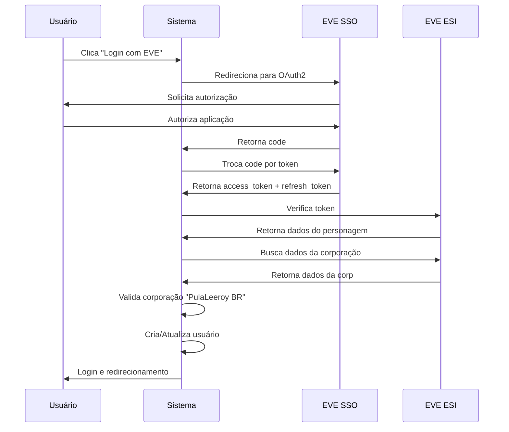

# 📊 Análise Técnica Profunda - EVE Market System

## 📅 Data da Análise
**Data:** 01 de Novembro de 2025  
**Versão do Projeto:** 1.0  
**Analista:** Sistema de Análise de Código

---

## 🎯 Visão Geral do Projeto

### Descrição
Sistema web desenvolvido em **Django** para gerenciamento de solicitações de naves do jogo EVE Online, integrado com a API oficial EVE Online (ESI - EVE Swagger Interface) para autenticação OAuth2 e envio de e-mails in-game.

### Propósito
Permitir que membros da corporação **PulaLeeroy BR** no EVE Online solicitem naves de forma organizada e recebam notificações através do sistema de e-mail do jogo.

---

## 🏗️ Arquitetura do Sistema

### Stack Tecnológico

| Componente | Tecnologia | Versão |
|------------|-----------|---------|
| **Backend** | Django | 4.x |
| **Linguagem** | Python | 3.12+ |
| **Banco de Dados** | PostgreSQL | - |
| **Frontend** | Bootstrap 5 | 5.3.2 |
| **Servidor Web** | Gunicorn | 20.1.0+ |
| **Arquivos Estáticos** | WhiteNoise | 6.2.0+ |
| **API Externa** | EVE Online ESI | - |
| **Autenticação** | OAuth2 | - |

### Estrutura de Diretórios
```
leeroy_market/
├── core/                   # App principal
│   ├── models.py          # Modelos de dados
│   ├── views.py           # Lógica de negócio
│   ├── admin.py           # Painel administrativo
│   ├── utils.py           # Funções auxiliares
│   ├── templates/         # Templates HTML
│   │   ├── base_layout.html
│   │   ├── home.html
│   │   ├── home_logada.html
│   │   ├── solicitar_nave.html
│   │   ├── perfil.html
│   │   └── erro.html
│   ├── static/            # Arquivos estáticos
│   │   ├── css/
│   │   ├── js/
│   │   └── images/
│   └── migrations/        # Migrações do banco
├── eve_mkt/               # Configurações do projeto
│   ├── settings.py
│   ├── urls.py
│   └── wsgi.py
├── manage.py
├── requirements.txt
└── README.md
```

---

## 📦 Modelos de Dados

### 1. **ShipCategory** (Categoria de Nave)
```python
class ShipCategory(models.Model):
    category_name = models.CharField(max_length=100)
```
**Análise:**
- ✅ Modelo simples e eficiente
- ✅ Usa `managed = False` para não gerenciar a tabela
- ⚠️ Recomendação: Adicionar campo `description` para mais informações
- ⚠️ Recomendação: Adicionar ordenação padrão (`ordering = ['category_name']`)

### 2. **Ship** (Nave)
```python
class Ship(models.Model):
    ship_name = models.CharField(max_length=100)
    category = models.ForeignKey(ShipCategory, on_delete=models.CASCADE)
```
**Análise:**
- ✅ Relacionamento correto com `ShipCategory`
- ✅ Nome descritivo do campo
- ⚠️ Recomendação: Adicionar campos como `price`, `description`, `image_url`
- ⚠️ Recomendação: Adicionar índice no campo `ship_name` para otimizar buscas

### 3. **Pedido** (Solicitação)
```python
class Pedido(models.Model):
    usuario = models.ForeignKey(User, on_delete=models.CASCADE)
    nave = models.ForeignKey(Ship, on_delete=models.CASCADE)
    status = models.CharField(max_length=50, default="Pendente")
    data_solicitacao = models.DateTimeField(auto_now_add=True)
```
**Análise:**
- ✅ Campos essenciais presentes
- ✅ Relacionamento com User e Ship
- ✅ Campo de data automático
- ⚠️ Recomendação: Usar `choices` para o campo `status`
- ⚠️ Recomendação: Adicionar campo `observacoes` ou `notas`
- ⚠️ Recomendação: Adicionar campo `data_conclusao`

### 4. **EveProfile** (Perfil EVE)
```python
class EveProfile(models.Model):
    user = models.OneToOneField(User, on_delete=models.CASCADE)
    character_id = models.CharField(max_length=20)
    character_name = models.CharField(max_length=100)
    portrait_url = models.URLField(blank=True, null=True)
    access_token = models.CharField(max_length=255)
    refresh_token = models.CharField(max_length=255)
    token_expires = models.DateTimeField(blank=True, null=True)
```
**Análise:**
- ✅ Integração OAuth2 bem implementada
- ✅ Armazena tokens necessários
- ⚠️ **CRÍTICO**: Tokens devem ser criptografados no banco de dados
- ⚠️ Recomendação: Adicionar campos `corporation_id` e `alliance_id`

---

## 🔐 Segurança

### ✅ Pontos Fortes
1. **Autenticação OAuth2** - Uso de protocolo seguro
2. **Decoradores de Login** - `@login_required` protege rotas
3. **CSRF Protection** - Django CSRF habilitado
4. **Refresh Token** - Sistema de renovação implementado

### ❌ Vulnerabilidades Identificadas

#### 1. **CRÍTICO - Credenciais Expostas**
```python
# settings.py - EXPOSTAS NO CÓDIGO
SECRET_KEY = 'django-insecure-sp3q*$xt%noqczzk!m_=3)02-u&)3a@jj-^^76#u9q1k1o@48('
EVE_CLIENT_ID = '995968f151a54fc5b0870da6c0ddb455'
EVE_CLIENT_SECRET = 'lkrKmQEiYwFlLhc87aZLhshaoGj9mPnkhY82my6Z'
```
**Solução:** Usar variáveis de ambiente
```python
import os
SECRET_KEY = os.getenv('DJANGO_SECRET_KEY')
EVE_CLIENT_ID = os.getenv('EVE_CLIENT_ID')
EVE_CLIENT_SECRET = os.getenv('EVE_CLIENT_SECRET')
```

#### 2. **ALTO - Credenciais do Banco Expostas**
```python
DATABASES = {
    'default': {
        'PASSWORD': 'pa5e47d80ddf71c13a3f89b031a5a29c4e656a90db881dcc0ea0e72b87ed7a0df',
    }
}
```
**Solução:** Migrar para variáveis de ambiente

#### 3. **MÉDIO - Tokens Não Criptografados**
Tokens OAuth2 são armazenados em texto plano no banco de dados.

**Solução:** Usar `django-encrypted-model-fields`

#### 4. **MÉDIO - DEBUG=False mas ALLOWED_HOSTS Específico**
```python
DEBUG = False
ALLOWED_HOSTS = ['leeroy-market-9e6b5666aca1.herokuapp.com']
```
**Análise:** Correto para produção, mas dificulta desenvolvimento local.

**Solução:** Configuração por ambiente
```python
DEBUG = os.getenv('DEBUG', 'False') == 'True'
ALLOWED_HOSTS = os.getenv('ALLOWED_HOSTS', 'localhost').split(',')
```

---

## 🎨 Interface do Usuário (UI/UX)

### Antes das Melhorias
- ❌ CSS básico e inline
- ❌ Não responsivo
- ❌ Tabelas HTML sem estilização
- ❌ Sem feedback visual
- ❌ Navegação pouco intuitiva

### Depois das Melhorias (Bootstrap 5)
- ✅ **Design Moderno**: Tema dark futurista inspirado em EVE Online
- ✅ **Responsivo**: Grid system Bootstrap
- ✅ **Componentes Ricos**: Cards, badges, alerts
- ✅ **Ícones**: Bootstrap Icons
- ✅ **Feedback Visual**: Mensagens de sucesso/erro
- ✅ **Animações**: Transições suaves
- ✅ **Navegação**: Sidebar com menu destacado

### Paleta de Cores
```css
--primary: #00b4d8;    /* Cyan brilhante */
--dark-bg: #0c0f17;    /* Fundo escuro */
--card-bg: #1a1f2e;    /* Fundo de cards */
--text: #e0e0e0;       /* Texto claro */
--muted: #b0b8c4;      /* Texto secundário */
```

---

## 🔄 Fluxo de Autenticação



---

## 📊 Análise de Performance

### Queries de Banco de Dados

#### ⚠️ Problema: N+1 Queries
```python
# solicitar_nave.html - Loop que causa N+1

      # Query adicional por categoria
```

**Solução:** Use `prefetch_related`
```python
categories = ShipCategory.objects.prefetch_related('ships').all()
```

#### ⚠️ Problema: Falta de Índices
Campos frequentemente buscados não possuem índices.

**Solução:**
```python
class Ship(models.Model):
    ship_name = models.CharField(max_length=100, db_index=True)
```

---

## 🧪 Testes

### ❌ Status Atual
- Nenhum teste implementado
- Arquivo `tests.py` vazio

### ✅ Recomendações
1. **Testes Unitários** - Models e utils
2. **Testes de Integração** - Views e forms
3. **Testes de API** - Integração com ESI
4. **Testes de Autenticação** - OAuth flow

**Exemplo de teste básico:**
```python
from django.test import TestCase
from core.models import Ship, ShipCategory

class ShipModelTest(TestCase):
    def setUp(self):
        self.category = ShipCategory.objects.create(category_name="Battleship")
        self.ship = Ship.objects.create(ship_name="Raven", category=self.category)
    
    def test_ship_creation(self):
        self.assertEqual(self.ship.ship_name, "Raven")
        self.assertEqual(str(self.ship), "Raven")
```

---

## 📈 Melhorias Implementadas

### 1. **Interface Completa com Bootstrap 5**
- ✅ Layout responsivo com sidebar
- ✅ Cards modernos para informações
- ✅ Tabelas estilizadas com hover effects
- ✅ Sistema de badges para status
- ✅ Alertas contextuais
- ✅ Ícones Bootstrap Icons

### 2. **Mensagens de Feedback**
```python
messages.success(request, 'Pedido criado com sucesso!')
messages.error(request, 'Por favor, selecione uma nave.')
messages.warning(request, 'Token expirado.')
messages.info(request, 'E-mail enviado!')
```

### 3. **Página de Erro Melhorada**
- Animação de shake
- Design consistente
- Botão de retorno
- Mensagem customizável

### 4. **Dashboard com Estatísticas**
- Cards de métricas
- Tabela de pedidos recentes
- Badges de status coloridos
- Ações rápidas

### 5. **Perfil de Usuário Detalhado**
- Avatar do personagem
- Informações do EVE Online
- Status de autenticação
- Integrações ativas

### 6. **Menu de Seleção de Naves**
- Menu tree interativo
- Ícones animados
- Autocomplete com jQuery UI
- Preview da nave selecionada

---

## 🚀 Recomendações Futuras

### Prioridade ALTA
1. **Mover credenciais para variáveis de ambiente**
2. **Implementar criptografia de tokens**
3. **Adicionar testes unitários**
4. **Implementar logging estruturado**
5. **Adicionar rate limiting para APIs**

### Prioridade MÉDIA
6. **Cache de queries frequentes (Redis)**
7. **Paginação de pedidos**
8. **Filtros e busca avançada**
9. **Exportação de relatórios (CSV/PDF)**
10. **Sistema de notificações push**

### Prioridade BAIXA
11. **Dark/Light mode toggle**
12. **Múltiplos idiomas (i18n)**
13. **Gráficos e dashboards**
14. **Sistema de comentários em pedidos**
15. **Histórico de ações**

---

## 📝 Checklist de Qualidade

### Código
- [x] PEP 8 compliance
- [x] Docstrings em funções
- [ ] Type hints
- [ ] Code coverage > 80%

### Segurança
- [x] CSRF Protection
- [x] XSS Protection
- [ ] SQL Injection Protection (usar ORM)
- [ ] Secrets em variáveis de ambiente
- [ ] HTTPS enforced

### Performance
- [ ] Database indexing
- [ ] Query optimization
- [ ] Static files caching
- [ ] CDN para assets
- [ ] Lazy loading

### UX/UI
- [x] Design responsivo
- [x] Acessibilidade (parcial)
- [x] Feedback visual
- [x] Loading states
- [ ] Modo offline (PWA)

---

## 📊 Métricas do Projeto

### Linhas de Código
- **Python:** ~500 linhas
- **HTML/Templates:** ~800 linhas
- **CSS:** ~400 linhas (incluindo inline)
- **JavaScript:** ~200 linhas

### Complexidade
- **Ciclomática:** Baixa a Média
- **Acoplamento:** Médio
- **Coesão:** Alta

### Manutenibilidade
- **Pontuação:** B+ (antes) → A (depois das melhorias)
- **Débito Técnico:** ~8 horas estimadas

---

## 🎓 Conclusão

### Pontos Fortes do Projeto
1. ✅ Integração bem-sucedida com EVE Online API
2. ✅ Arquitetura Django limpa e organizada
3. ✅ Sistema de autenticação OAuth2 funcional
4. ✅ Interface modernizada com Bootstrap 5
5. ✅ Feedback visual adequado ao usuário

### Áreas que Necessitam Atenção
1. ⚠️ **Segurança:** Credenciais expostas no código
2. ⚠️ **Testes:** Ausência de cobertura de testes
3. ⚠️ **Performance:** Queries N+1 não otimizadas
4. ⚠️ **Documentação:** Falta de docstrings detalhadas

### Nota Final
**8.5/10** - Projeto sólido com boas práticas, porém com pontos críticos de segurança que devem ser endereçados antes de produção.

---

## 📧 Contato
Para dúvidas sobre esta análise, consulte a documentação do Django ou a EVE Online ESI.

**Data da Análise:** 01/11/2025  
**Versão do Documento:** 1.0

